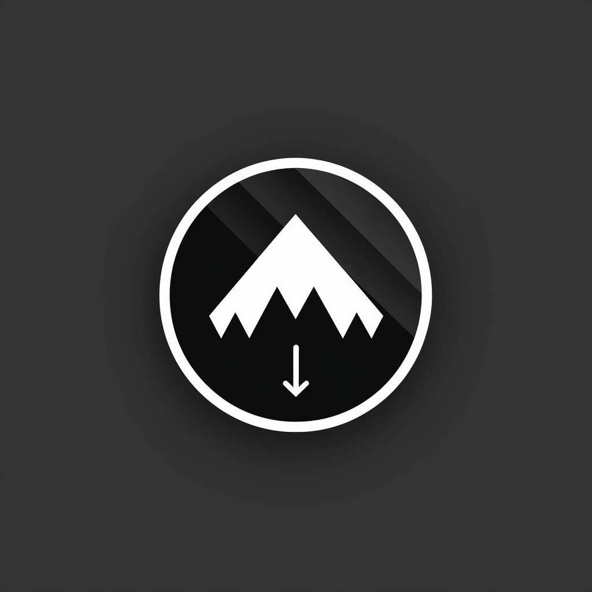

# Kinozal Monitor

<p align="center">
    
</p>

[](https://github.com/aladex/kinozal_monitor/actions)
[](https://golang.org/dl/)
[](https://hub.docker.com/r/aladex/kinozal_monitor)
[](https://github.com/aladex/kinozal_monitor/releases)
[](https://codecov.io/gh/aladex/kinozal_monitor)

## Overview

Kinozal Monitor is an advanced torrent management tool designed to streamline interactions between kinozal.tv and qBittorrent. This robust solution provides comprehensive torrent management capabilities with real-time WebSocket updates, making it easier to track, add, and remove torrents across different platforms.

## Features

- 🔗 Add torrents by URL
- 🗑️ Remove torrents by ID
- 📋 List all current torrents
- 👀 Torrent watching functionality
- 🔌 Real-time WebSocket updates
- 📂 Flexible download path selection

## Prerequisites

- Go 1.24+
- Docker (optional)
- qBittorrent account
- Kinozal.tv account

## Installation

### Docker Deployment

```bash
# Clone the repository
git clone https://github.com/aladex/kinozal_monitor.git
cd kinozal_monitor

# Start the service
docker-compose up -d
```

### Local Installation

```bash
# Clone the repository
git clone https://github.com/aladex/kinozal_monitor.git
cd kinozal_monitor

# Download dependencies
go mod download

# Build the application
go build

# Run the application
./kinozal_monitor
```

## Configuration

Create a `config.ini` file with the following structure:

```ini
[qbittorrent]
username = your_qbittorrent_username
password = your_qbittorrent_password
url = your_qbittorrent_url

[kinozal]
username = your_kinozal_username
password = your_kinozal_password
```

Alternatively, use environment variables:
- `QB_USERNAME`
- `QB_PASSWORD`
- `QB_URL`
- `KZ_USERNAME`
- `KZ_PASSWORD`

## API Endpoints

- `GET /api/torrents`: Retrieve all torrents
- `GET /api/download-paths`: List available download paths
- `POST /api/add`: Add a new torrent
- `POST /api/watch`: Set torrent watch flag
- `DELETE /api/remove`: Remove a torrent
- `GET /ws`: WebSocket real-time updates

## Development

### Running Tests

```bash
# Run unit tests
go test ./...

# Run tests with race condition detection
go test -race ./...

# Generate coverage report
go test -coverprofile=coverage.out ./...
```

### Code Quality

The project uses:
- `go vet` for static analysis
- `staticcheck` for additional linting
- `gosec` for security scanning
- `govulncheck` for vulnerability checking

## Contributing

1. Fork the repository
2. Create your feature branch (`git checkout -b feature/AmazingFeature`)
3. Commit your changes (`git commit -m 'Add some AmazingFeature'`)
4. Push to the branch (`git push origin feature/AmazingFeature`)
5. Open a Pull Request

## License

Distributed under the MIT License. See `LICENSE` for more information.

## Contact

Project Link: [https://github.com/aladex/kinozal_monitor](https://github.com/aladex/kinozal_monitor)